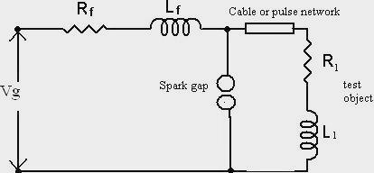
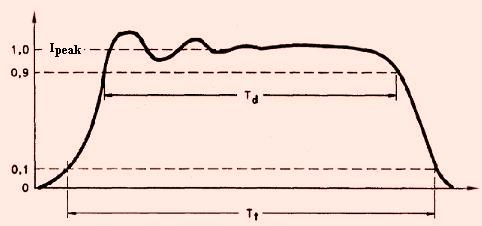
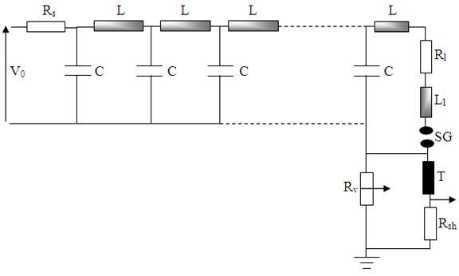

## Theory

The basic circuit for producing rectangular pulses is given in Fig. 1. The length of a cable or an equivalent pulse forming network is charged to a specified d.c. voltage. When the spark gap is short-circuited, the cable pulse network discharges through the test object. To produce a rectangular pulse, a coaxial cable of surge impedance Zo=√L/C (where L is the inductance per unit length and C is the capacitance per unit length) is used. If the cable is charged to a voltage Vg and discharged through the test object of resistance Rl and inductance Ll, the current pulse I generated is given by I=Vg / (Zo+Z) (1) (where Z = (Rl2+(2*Π*f*Ll)2)(0.5)). A pulse voltage Z*Vg / (Z+Zo) is developed across the test object and pulse current is sustained by a voltage wave. For Z = Zo, the reflected wave from the open end of the cable terminates the pulse current into the test object, and the pulse voltage becomes equal to Vg/2. In practice, it is difficult to get a coaxial cable of sufficient capacitance and length. Often artificial transmission line with lumped L and C are used.  

Fig. 1. Basic circuit for producing rectangular pulse waveform

The artificial line is a chain of L or Π sections, each section containing series inductance and shunt capacitance, as shown in Fig. 3. Any change that occurs on a transmission line takes the form of a voltage wave and current wave travelling together in one direction or the other, i.e. two pairs of waves travelling in opposite directions simultaneously. The velocity of propagation of each wave is 1/√LC, where L and C are the inductance and capacitance per unit length (or per section) of the line.  

Fig. 2. General waveform of regtangular Impulse current

Fig. 2 shows the standard wave shape of rectangular pulse current. Total duration (Td) is virtual parameter defined as the time during which the current is greater than 90% of its peak value. Time (Tt) is defined as the time during which the current is greater than 10% of its peak value.  

Fig. 3. Typical circuit for generation of regtangular Impulse current

The time to travel (τ), characteristic impedance (Z0), current pulse generated through the load resistor (I) and duration of the pulse are given by:

τ=√(LC) 
Zc=√(L/C) 

I=V0/2Ri

T=2(N-1)√(LC) 

where, N=no. of L-sections